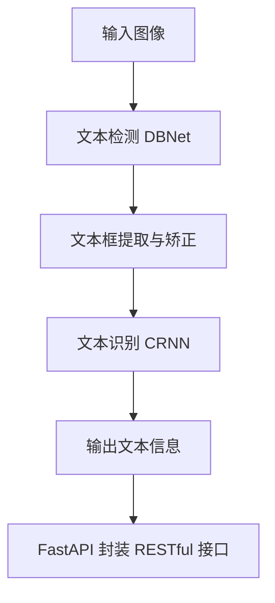

# 基于深度学习的文字识别系统项目文档（DBNet + CRNN + FastAPI）

---

## 一、项目背景与动机

本项目是基于本人实习计划，结合近两学期所学课程内容（包括深度学习、大模型平台应用、Docker容器、Linux部署、FastAPI 封装等）开展的综合实践型软件开发项目。目标是构建一个完整的文字识别系统（OCR），支持图片中的文本检测与识别，封装为 RESTful API 接口，便于集成和部署。

在信息数字化快速发展的背景下，图片中的文字数据提取变得尤为重要，广泛应用于票据识别、文档归档、智能表单等领域。传统 OCR 方法识别率较低、适应性差，本项目旨在通过深度学习方式提高识别精度和系统通用性。

---

## 二、项目所解决的实际问题

传统 OCR 工具难以准确处理复杂场景（如倾斜文本、背景干扰、变形字体等）。本项目通过融合深度神经网络技术，实现图像中的文本区域检测与精确识别，解决了：

- 高精度的文本检测与识别问题
- 快速部署于服务器端、可扩展调用的问题
- 与主流系统集成时缺乏标准 API 的问题

---

## 三、解决方案的技术类别

当前图像文字识别问题主要解决方案包括：

- 传统方法：基于图像处理与字符匹配技术（如 Tesseract）
- 基于深度学习的端到端方法（如 CRNN、Transformer、ViT）
- 两阶段方法：文本检测（如 DBNet、EAST）+ 文本识别（如 CRNN、RARE）

本项目采用的是 **两阶段方法**：

- 文本检测：使用 DBNet（Differentiable Binarization）
- 文本识别：使用 CRNN（Convolutional Recurrent Neural Network）

---

## 四、方法介绍与技术细节

### 1. 系统架构图



### 2. DBNet 主要思想

DBNet 是一种基于可微二值化（Differentiable Binarization）策略的文本检测模型，通过学习一个概率二值图来获得更精确的文本区域。

核心公式如下：

$$
B(x) = \frac{1}{1 + e^{-k(P(x) - T(x))}} 
$$

其中：

- \(P(x)\)：预测概率图
- \(T(x)\)：可学习的阈值图
- \(k\)：缩放系数

### 3. CRNN 模型架构

- 卷积层提取图像特征
- 双向 LSTM 捕捉序列信息
- CTC（Connectionist Temporal Classification）解码识别文字

### 4. 关键代码片段（简略）

```python
# 文本检测
from models.dbnet import DBNet
model = DBNet()
boxes = model.detect(image)

# 文本识别
from models.crnn import CRNN
recognizer = CRNN()
for box in boxes:
    cropped = crop_image(image, box)
    text = recognizer.predict(cropped)
```

---

## 五、FastAPI 封装说明

### 1. 项目结构

```
ocr_project/
├── main.py              # FastAPI 主入口
├── api.py               # API 路由定义
├── models/
│   ├── dbnet.py         # DBNet 模型封装
│   └── crnn.py          # CRNN 模型封装
├── utils/
│   └── image_utils.py   # 图像预处理工具
└── weights/             # 模型权重目录（需用户手动下载）
```

### 2. API 说明

#### 2.1 `/ocr/image` - 图像文字识别

- **请求方式**：`POST`

- **路径**：`/ocr/image`

- **请求类型**：`multipart/form-data`

- **请求参数**：

  - `file`: 图像文件（PNG/JPG）

- **返回格式**：`application/json`

- **返回字段**：

```json
{
  "text": [
    {
      "box": [[x1, y1], [x2, y2], [x3, y3], [x4, y4]],
      "content": "识别出来的文字"
    },
    ...
  ]
}
```

### 3. FastAPI 启动方式

```bash
uvicorn main:app --reload --host 0.0.0.0 --port 8000
```

---

## 六、运行效果截图

> 此部分需在实际部署与测试后截图并补充，建议包括：

- 使用 Postman 调用 `/ocr/image` 接口上传图像并返回识别结果截图
- 接口请求 JSON 与返回数据展示截图

---

## 七、数据集说明

本项目训练与测试使用 **ICDAR2015** 数据集（公开）

- 下载地址：[https://rrc.cvc.uab.es/?ch=4](https://rrc.cvc.uab.es/?ch=4)
- 数据目录结构：

```
ICDAR2015/
├── train_images/
├── train_labels/
├── test_images/
├── test_labels/
```

---

## 八、代码模块说明

### 1. 方法核心代码

- `models/dbnet.py`: 实现 DBNet 网络结构与预测函数
- `models/crnn.py`: 实现 CRNN 网络结构与文字识别预测

### 2. 封装 API 的代码

- `main.py`：FastAPI 实例化及路由挂载
- `api.py`：OCR 路由 `/ocr/image` 的定义

### 3. 调用 API 的测试代码

```python
# test.py
import requests
files = {"file": open("test.jpg", "rb")}
response = requests.post("http://localhost:8000/ocr/image", files=files)
print(response.json())
```

### 4. Linux 启动脚本示例

```bash
#!/bin/bash
source venv/bin/activate
uvicorn main:app --host 0.0.0.0 --port 8000
```

---

如需我继续补充模型权重获取方法、环境部署说明、Dockerfile、运行截图等，请告知。

